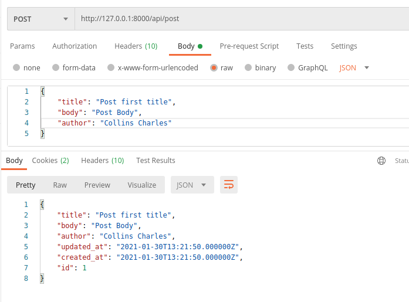

# Restful API using...

### Post

> Route /post

| Verb      | URI   | Action | Route Name  |
| --------- | ----- | ------ | ----------- |
| GET       | /     | index  | post.index  |
| GET       | /{id} | show   | post.show   |
| POST      | /     | store  | post.store  |
| PUT/PATCH | /{id} | update | post.update |
| DELETE    | /{id} | delete | post.delete |

> Sample response

> -   By - Collins Abadaike abadaikecollins@gmail.com
